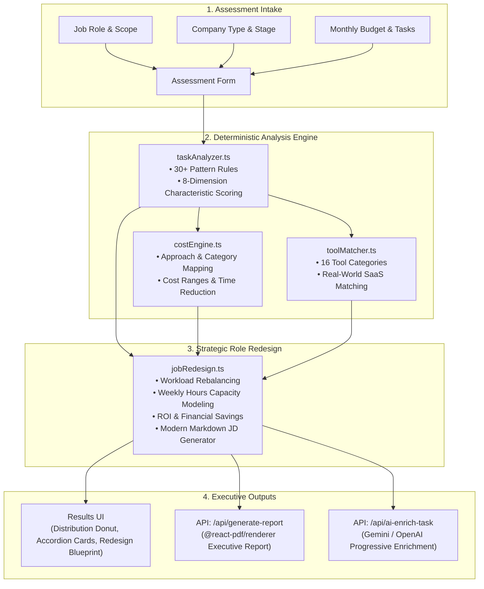

# HireLens 🔍 — AI vs. Human Workforce Intelligence Platform

[](https://nextjs.org/)
[](https://react.dev/)
[](https://www.typescriptlang.org/)
[](https://tailwindcss.com/)
[](https://vitest.dev/)

> **Should you hire a full-time employee or deploy an automation stack?**  
> HireLens is a strategic workforce analysis platform built for founders, agency owners, and hiring managers. It evaluates roles at a granular, task-by-task level to determine what should stay human, what can be automated by AI/software, what should be outsourced, and how to **redesign the role** for maximum leverage and ROI.

---

## 🌟 Key Highlights

- **🧠 Deterministic 8-Dimension Task Scoring**: Evaluates repetition, predictability, digital nature, human judgment, emotional intelligence, creativity, physical presence, and sensitivity risk.
- **⚡ Client-Side Zero-Latency Engine**: Instant recommendations (`AI / AUTOMATE`, `HUMAN`, `HYBRID`, `OUTSOURCE`) without requiring an API key.
- **🔧 16-Category Tool Matcher**: Recommends real-world software solutions (CRMs, scheduling engines, document processors, AI assistants) with pricing and human-in-the-loop requirements.
- **🤖 Progressive AI Enrichment**: Optional LLM integration (Gemini 1.5 Flash / GPT-4o-mini) with resilient deterministic fallback. Generates step-by-step implementation plans, workflow diagrams, and risk audits.
- **✨ Phase 6: Modern Job Redesign Engine**:
  - Rebalances the workload into **Elevated Human Tasks**, **AI-Supervised Workflows**, and **Eliminated Automated Tasks**.
  - Derives an upgraded modern role title (e.g. *Operations Coordinator* → *Operations Workflow Specialist*).
  - Calculates weekly capacity freed (e.g. 24 hrs/week freed, 60% efficiency gain).
  - Estimates net monthly and annual financial savings.
  - Generates a **1-click copyable modern Markdown Job Description** ready for LinkedIn, Indeed, or ATS posting.
- **📄 Executive PDF Generation**: Built with `@react-pdf/renderer` for professional executive reports with distribution charts, cost summaries, and per-task breakdowns.

---

## 🏗️ System Architecture



---

## 📊 Workforce Verdict Matrix

| Recommendation | Criteria | Typical Strategy |
|---|---|---|
| **`AI / AUTOMATE`** | High repetition (85%+), high digital nature, low judgment | Replace manual execution with automated scripts, connectors, or AI agents. |
| **`HUMAN`** | High judgment (70%+), empathy, high sensitivity risk | Retain strictly for human expertise, executive negotiations, and leadership. |
| **`HYBRID`** | Moderate predictability with critical quality checkpoint | AI drafts and processes raw inputs; human operator reviews and approves. |
| **`OUTSOURCE`** | Specialized modular work with low organizational context | Delegate to specialized fractional contractors or agencies. |

---

## 📁 Repository Structure

```
HireLens/
├── src/
│   ├── app/
│   │   ├── layout.tsx                    # Root layout with Geist font & SEO
│   │   ├── page.tsx                      # Main single-page application workflow
│   │   ├── globals.css                   # Tailwind CSS v4 directives
│   │   └── api/
│   │       ├── ai-enrich-task/           # Progressive LLM enrichment API (Gemini/OpenAI)
│   │       └── generate-report/          # PDF executive report generation endpoint
│   │           └── __tests__/            # PDF route unit & integration tests
│   ├── components/
│   │   ├── Header.tsx                    # Brand header with navigation
│   │   ├── AssessmentForm.tsx            # Multi-step intake form with validation
│   │   ├── TaskInputList.tsx             # Interactive dynamic task editor
│   │   ├── ResultsPage.tsx               # Primary results dashboard & PDF download flow
│   │   ├── JobRedesignSection.tsx        # Phase 6: Interactive redesign blueprint & JD
│   │   ├── TaskAnalysisCard.tsx          # Per-task analysis accordion & AI tabs
│   │   ├── ScoreBar.tsx                  # Animated score progress bar
│   │   ├── RecommendationBadge.tsx       # Color-coded verdict pill
│   │   └── pdf/
│   │       └── ExecutiveReportPdf.tsx    # Multi-page PDF layout (@react-pdf/renderer)
│   ├── lib/
│   │   ├── taskAnalyzer.ts               # Core keyword heuristic & scoring engine
│   │   ├── jobRedesign.ts                # Phase 6: Role rebalancing & ROI engine
│   │   ├── costEngine.ts                 # Automation cost, risk, & time engine
│   │   ├── toolMatcher.ts                # SaaS solution matching algorithm
│   │   ├── toolCatalog.ts                # 16-category tool dataset
│   │   ├── automationCatalog.ts          # Automation category presets
│   │   ├── aiFallback.ts                 # Deterministic fallback for AI intelligence
│   │   ├── reportBuilder.ts              # Data aggregator for executive PDF reports
│   │   └── __tests__/                    # Vitest unit test suite (7 files, 76 tests)
│   └── types/                            # Strict TypeScript domain interfaces
│       ├── assessment.ts
│       ├── jobRedesign.ts
│       ├── automation.ts
│       ├── tools.ts
│       ├── aiIntelligence.ts
│       └── report.ts
├── .env.example                          # Documented environment variables
├── package.json
└── tsconfig.json
```

---

## 🚀 Quick Start

### 1. Prerequisites
- **Node.js**: v18.18+ or v20+
- **npm**, **pnpm**, or **yarn**

### 2. Installation
```bash
git clone https://github.com/your-username/hirelens.git
cd hirelens
npm install
```

### 3. Environment Variables (Optional)
Copy the example file:
```bash
cp .env.example .env.local
```
*(Optional: Add `GEMINI_API_KEY` or `OPENAI_API_KEY` if you want progressive LLM task breakdowns; otherwise, the built-in deterministic fallback operates automatically).*

### 4. Run Development Server
```bash
npm run dev
```
Open [http://localhost:3000](http://localhost:3000) in your browser.

---

## 🧪 Testing

HireLens features a unit test suite built with **Vitest**:

```bash
# Run all unit and API tests
npm test

# Run tests in watch mode
npm run test -- --watch
```

**Test Coverage Summary:**
- ✅ `taskAnalyzer.test.ts` (26 tests) — Heuristic scoring, edge cases, keyword matching
- ✅ `costEngine.test.ts` (10 tests) — Cost boundaries, risk classification, approach detection
- ✅ `toolMatcher.test.ts` (12 tests) — Categorical tool search and ranking
- ✅ `jobRedesign.test.ts` (6 tests) — Capacity modeling, savings calculations, JD generation
- ✅ `reportBuilder.test.ts` (7 tests) — PDF data aggregation, tool deduplication
- ✅ `aiIntelligence.test.ts` (11 tests) — Schema validation, deterministic fallback verification
- ✅ `generate-report/route.test.ts` (4 tests) — PDF buffer generation, headers, error resilience

---

## 🚢 Deployment

### Deploy to Vercel (Recommended)
HireLens is fully optimized for Vercel:

1. Push your repository to GitHub / GitLab.
2. Import the project into [Vercel](https://vercel.com/new).
3. (Optional) Set your `GEMINI_API_KEY` or `OPENAI_API_KEY` under **Environment Variables**.
4. Click **Deploy**.

---

## 🛡️ Engineering Principles

- **Zero-Crash Resiliency**: Any API outage (LLM or PDF) gracefully falls back to deterministic client logic.
- **Strict Typing**: 100% TypeScript coverage without `any` escapes in core domain paths.
- **Privacy-First**: No user task inputs are persisted or transmitted unless an optional LLM enrichment request is explicitly triggered.

---

## 📄 License

Distributed under the **MIT License**. See `LICENSE` for more information.
